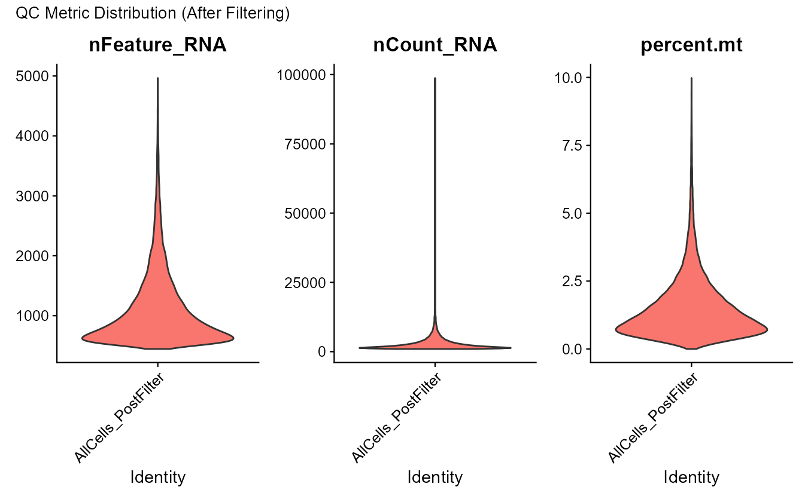
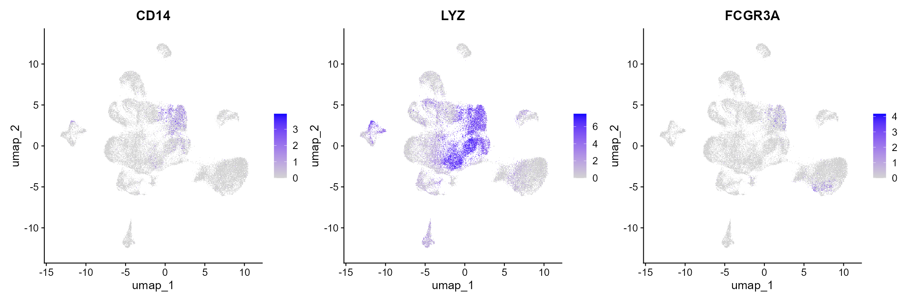

# **Analysis of the Immune Microenvironment in Acute Myeloid Leukemia Based on Single-Cell Transcriptomics**  
This project presents a **complete and reproducible single-cell RNA-seq analysis workflow**. Using publicly available single-cell datasets (GSE116256, AML patients vs healthy bone marrow samples), 
it completes the full pipeline from **quality control** to **enrichment analysis**.  

Results reveal that **CD4⁺ T cells in AML patients exhibit abnormal hyperactivation and proliferative signaling**, providing new insights into the mechanisms of immune evasion.  
  
This project corresponds to **Phase A** of my master’s thesis and future PhD proposal, representing the **first stage** of my planned “three-phase technical roadmap”:  
- A Single-cell RNA-seq workflow: quality control, clustering, differential expression, and enrichment analysis  
- B Multi-omics and drug extension: integrating scATAC analysis and transcriptional regulation prediction  
- C Clinical and spatial integration: combining single-cell with spatial transcriptomics or clinical prognosis data to evaluate spatial distribution and clinical significance of cell populations  

## **Main Research Topics (Phase A):**  
1. Identify the major immune microenvironmental cell types present in AML  
2. Characterize abnormally activated or proliferative immune cell subtypes under disease conditions  
3. Investigate key genes and signaling pathways involved in immune regulation  

## **Technical Roadmap:**  

  

## **Analysis Workflow:**
### **1. Data Preprocessing (Quality Control)**
(1) Perform quality control (QC) to remove low-quality cells and potential doublets.  
(2) The following violin and scatter plots illustrate the effect of QC metrics (`nFeature_RNA`, `nCount_RNA`, and `percent.mt`) before filtering.  
**Before filtering:**  

  
  

  <em>Before filtering: violin plots (left) and scatter plots (right) showing raw QC metrics.</em>

 

**After filtering:**  

  
  

  <em>After filtering: improved metric distributions and removal of low-quality cells.</em>

Highly variable genes: *Red dots indicate genes selected for subsequent principal component analysis (PCA) and clustering analysis.*  

  

  <em>Scatter plot showing variable feature selection after normalization.</em>

### **2. Dimensionality Reduction and Clustering**  
Perform **PCA** and **UMAP** to identify the optimal clustering resolution and generate 2D **UMAP** plots (colored by cluster, sample, or cell type).  

**PCA & Elbow Plot**  

  

<em>PCA of cells by sample (left) and the elbow plot for PC selection (right).</em>

 

**Finding the Optimal Clustering Resolution**  

  

<em>UMAP clustering at different resolutions.</em>

  

<em>Final UMAP clustering (resolution = 0.8).</em>

 

**UMAP Validation: Sample and Time**  

  
  

  <em>Left:</em> UMAP colored by sample. <em>Right:</em> UMAP colored by time.

### **3. Cell Type Annotation**
(1) Calculate **marker genes** for each cluster and compare them with reference marker gene dictionaries.  
(2) To validate cluster annotations, we used **FeaturePlot**, **DotPlot**, and **VlnPlot** to visualize representative marker genes.  

**Representative Feature Plots:**  
 

  

  <em>FeaturePlot of monocyte markers (CD14, LYZ, FPR1).</em>

 

**Violin Plot and Dot Plot:**  

  
  

  <em>Left:</em>  DotPlot showing canonical marker expression across clusters. 
  <em>Right:</em>  VlnPlot showing expression variability among canonical markers.

**Cluster-level heatmap & Cell-type annotated heatmap:**  

  
  

  
*Left:*  Top 3 markers per unsupervised cluster.&nbsp;&nbsp;&nbsp;&nbsp;  
*Right:*  Top 3 markers per annotated immune cell type.

### **4. Differential Expression and Functional Enrichment**
(1) Focus on **CD4⁺ T cells**, comparing **AML patients vs healthy controls**.  
(2) Use `FindMarkers()` to identify **differentially expressed genes (DEGs)** and visualize them using a **volcano plot**.  

**Volcano Plot:**

  &nbsp;&nbsp;&nbsp;&nbsp;&nbsp;
  

  <em>Volcano plot of DEGs in CD4⁺ T cells (AML vs Healthy).</em>

 

  
  

  <em>GO (Biological Process) enrichment analysis of upregulated genes:   barplot (left) and dotplot (right).</em>

 

  
  

  <em>KEGG pathway enrichment analysis of upregulated genes:   barplot (left) and dotplot (right).</em>

## **Key Findings:**
Functional enrichment analysis of **CD4⁺ T cells** revealed significant **transcriptional reprogramming** in **AML patients**.  
The **GO** results showed significant enrichment in biological processes such as **RNA localization**, **cytoplasmic translation**, **DNA replication**, and **ribosome biogenesis**,  
Suggesting **enhanced transcriptional and protein synthesis activity** in **CD4⁺ T cells**.  
The **KEGG** analysis further indicated enrichment in **cell cycle–related pathways** (e.g., **DNA replication, repair, and autophagy**),  
demonstrating that **CD4⁺ T cells in the AML microenvironment exhibit abnormal activation and hyperproliferative characteristics**.
Together, these findings suggest that **CD4⁺ T cells in AML may enter a state of excessive activation and dysregulated cell cycling**.  

## **Analysis Environment and Dependencies: **  
The analysis was conducted in **R 4.4**, using **renv** for package version and dependency management.  
It was executed within **Visual Studio Code (VSC)**using the **Jupyter** extension,  
ensuring a fully reproducible single-cell analysis environment. (Code is available in the `.ipynb` file located in the project root directory.)

**Main R Packages Used:**  
**Seurat:** For quality control, normalization, clustering, and visualization of single-cell transcriptomic data.  
**clusterProfiler:** For gene set enrichment analysis and KEGG / GO functional annotation.  
**ggplot2:** For high-quality, publication-ready data visualization.  
**pheatmap:** For generating expression or clustering heatmaps.  
**patchwork:** For combining multiple ggplot figures into composite layouts.  
